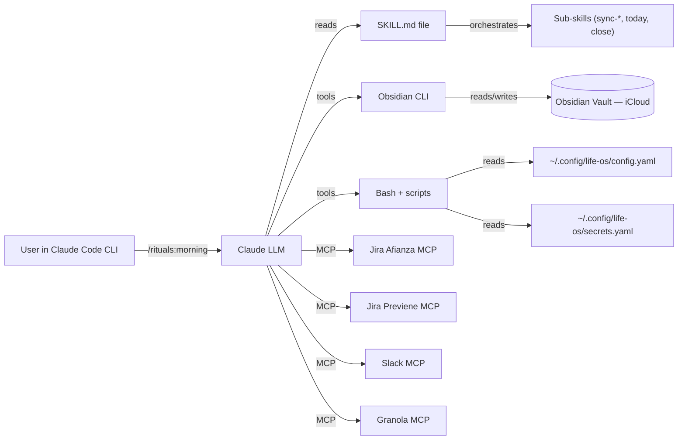
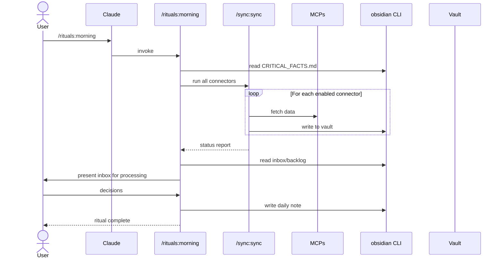

# Architecture — Life OS

## Architectural Style

**Skill-oriented plugin architecture** on top of Claude Code CLI. There is no traditional application runtime — the "app" is a set of declarative markdown skills that the LLM executes when the user invokes a slash command.

Pattern characteristics:

- **No server**, no compiled binary, no long-running process.
- **No client UI**. The user-facing surface is the Claude Code CLI prompt + the Obsidian vault on disk.
- **State is on disk**: vault markdown + YAML configs.
- **Side effects flow through tools**: Bash, `obsidian` CLI, MCP servers, and the LLM itself.

## High-Level Diagram



## Layers

### 1. Marketplace Layer

`.claude-plugin/marketplace.json` declares 5 plugins. Each plugin is independently installable, versioned (`0.1.0` currently), and self-contained inside its folder.

### 2. Plugin Layer

Each plugin (`rituals/`, `sync/`, `wiki/`, `training/`, `content/`) has:

- `.claude-plugin/plugin.json` — manifest (name, description, version, keywords).
- `skills/<name>/SKILL.md` — one or more skill files.
- Optionally `hooks/` (currently only `rituals/hooks/hooks.json`).

### 3. Skill Layer

A skill is a markdown file with YAML frontmatter:

```yaml
---
name: morning
description: Use when starting the day, running the morning routine...
---
```

Two kinds:

- **User-invocable** — has `description:`. The LLM may invoke it when the user mentions matching triggers.
- **Internal** — has no `description:`. Called only by other skills (e.g., the `sync-*` family is invoked by `/sync`).

The skill body is a deterministic procedure the LLM follows: load config, read vault state, call tools/MCPs, write results back to vault, report.

### 4. Configuration Layer

- **`~/.config/life-os/config.yaml`** — runtime config (vault path, vault folder structure, date formats, tag taxonomy, project names, Jira assignee, calendar tool, etc.). Template at `config.example.yaml`.
- **`~/.config/life-os/secrets.yaml`** — API keys (e.g., Telegram). 600 perms. Never committed.
- **`{vault}/config/connectors.yaml`** — per-connector enable/disable, channel lists, Jira projects. Lives **inside the vault** so it syncs across machines via iCloud. Template at `connectors.example.yaml`.
- **`{vault}/config/goals.yaml`** — user goals (referenced by daily/weekly notes).
- **`{vault}/08 Resources/CRITICAL_FACTS.md`** — identity layer loaded by every ritual.

### 5. Data Layer

The vault is the database. Key folders (configurable in `config.yaml`):

| Vault path | Purpose |
|------------|---------|
| `00 Inbox.md` | Capture surface |
| `01 Backlog.md` | Tasks queue |
| `02 Projects/` | Active project notes |
| `03 Daily/` | Daily notes (one file per day) |
| `04 Weekly/` | Weekly notes |
| `05 People/` | People notes |
| `06 Jira/` | Synced Jira tickets (per-instance) |
| `07 Meetings/` | Meeting notes (Granola-sourced) |
| `08 Resources/wiki/` | **Synthesized knowledge** (Karpathy-style atomic pages) |
| `08 Resources/wiki/log.md` | Append-only wiki activity log |
| `08 Resources/CRITICAL_FACTS.md` | Operational identity layer |
| `.cache/` | Sync caches, ephemeral state |

### 6. External Integrations Layer

| Integration | Mechanism | Used by |
|-------------|-----------|---------|
| Jira Afianza | MCP server `jira-afianza` | `sync-jira` |
| Jira Previene | MCP server `jira-previene` | `sync-jira` |
| Slack | MCP server (configurable) | `sync-slack` |
| Granola | MCP server | `sync-granola` |
| Apple Calendar / Gmail / Outlook | `icalbuddy` CLI | `sync-calendar` |
| Telegram | HTTP API to a Fly.io-hosted bot (`secrets.telegram.api_key`) | `sync-telegram` |
| Heavy / Strong CSV | Local CSV in `~/Downloads/` | `sync-training` |

## Data Flow (Morning Ritual Example)



## Architectural Decisions

| Decision | Rationale | Source |
|----------|-----------|--------|
| Multi-plugin marketplace vs single plugin | Users install only what they need; plugins evolve independently | git `297846f` |
| Vault is the database (no DB) | Markdown-first; everything in iCloud Obsidian sync | `.planning/PROJECT.md` |
| Internal sub-skills (no `description:`) for `sync-*` | Avoid polluting user-invocable skill list; orchestrate via `/sync` | Phase 03 decision |
| All vault I/O via `obsidian` CLI | Routes through Obsidian's API → respects sync, plugins, wikilinks | `CLAUDE.md` |
| Source-agnostic meeting notes | Don't couple to Granola; abstraction survives future provider swaps | git history / former `.planning/PROJECT.md` |
| Per-instance Jira MCPs | Each org runs its own Jira; clean separation, no hardcoded URLs | git history / former `.planning/PROJECT.md` |
| Wiki = synthesized layer with strict frontmatter | Karpathy-style atomic, interlinked, LLM-retrievable pages | `08 Resources/wiki/WIKI.md` (in vault) |
| Connectors config lives **inside** the vault | Syncs across machines automatically via iCloud | `config.example.yaml` |
| Secrets in separate file, not committed | Security; permissions 600 | `config.example.yaml` |
| BMad as the only planning layer | Legacy `.planning/` (GSD) and `.compound-engineering/` removed 2026-05-19 to simplify | this session |

## Testing Strategy

No automated test suite (markdown skills have no traditional unit-test surface). **Validation is usage-based**:

- User runs a skill and reports back.
- Phase 03 introduced the **usage gate**: validate each skill before building the next.
- Lint operates inside the wiki (`/wiki:lint` detects orphans, dead links, stale pages).

## Deployment

This is a marketplace consumed via Claude Code's plugin system. "Deployment" = pushing to GitHub. Users pull via:

```
/plugin marketplace add github:aldorea/life-os
/plugin install <plugin>@life-os
```

No build step. No CI/CD pipelines.

## Failure Modes & Resilience

- **Connector independence**: each sync connector is independently degradable — if Jira fails, calendar still syncs (Phase 1 decision).
- **Config missing**: skills detect missing config and instruct the user to copy the example.
- **Vault not synced**: vault on iCloud — divergence is a known risk. Mitigated by going through the `obsidian` CLI which respects Obsidian's internal locking.
- **MCP server down**: skills degrade to "skipped" status in the sync report rather than failing the whole ritual.

## Security

- Secrets isolated in `~/.config/life-os/secrets.yaml` (600 perms).
- No credentials in repo. `.gitignore` covers `_bmad-output/`, `.worktrees/`, etc.
- Calendar is read-only — no risk of accidental writes.
- Jira/Slack/Granola access controlled by MCP server auth (per user, per machine).
