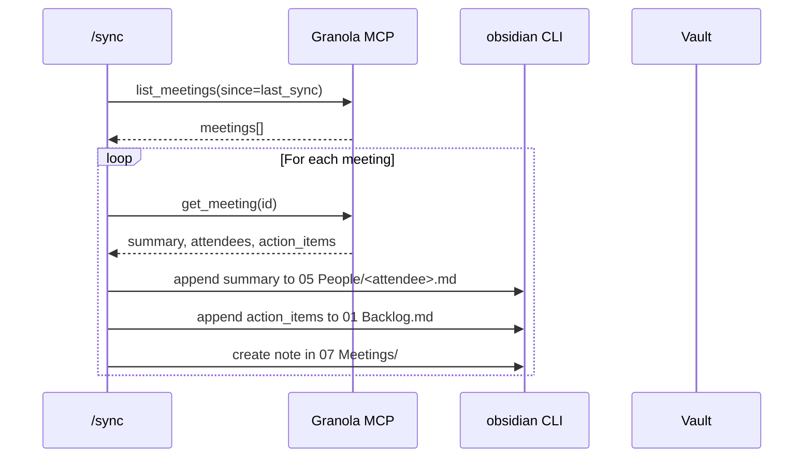
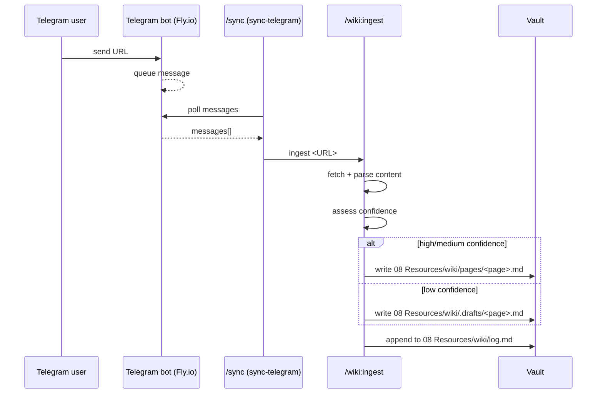

# Integration Architecture — Life OS

> How the marketplace plugins, the Obsidian vault, MCP servers, and external services connect.

## Component Map

```mermaid
flowchart TB
    subgraph CCC[Claude Code CLI]
        Claude[Claude LLM]
        Skills[Skills loaded from plugins]
    end

    subgraph Plugins[life-os marketplace]
        Rituals[rituals]
        Sync[sync]
        Wiki[wiki]
        Training[training]
        Content[content]
    end

    subgraph Config[Local config]
        UserCfg[~/.config/life-os/config.yaml]
        Secrets[~/.config/life-os/secrets.yaml]
    end

    subgraph Vault[Obsidian Vault — iCloud]
        VaultData[Daily / Weekly / Backlog / People / Meetings]
        WikiData[08 Resources/wiki/]
        ConnCfg[config/connectors.yaml]
        Goals[config/goals.yaml]
        Critical[08 Resources/CRITICAL_FACTS.md]
    end

    subgraph MCPs[MCP servers]
        JiraA[jira-afianza]
        JiraP[jira-previene]
        SlackMCP[slack]
        GranolaMCP[granola]
    end

    subgraph External[External tools / APIs]
        ICalBuddy[icalbuddy CLI → Apple + Gmail + Outlook calendars]
        TelegramBot[Telegram bot on Fly.io]
        HeavyCSV[Heavy/Strong CSV in ~/Downloads/]
    end

    Claude --> Skills
    Skills -- read --> UserCfg
    Skills -- read --> Secrets
    Skills -- "obsidian CLI" --> Vault
    Skills -- "MCP tool calls" --> MCPs
    Skills -- "Bash" --> External

    Rituals -. delegates to .-> Sync
    Sync -- "fetch data" --> JiraA
    Sync -- "fetch data" --> JiraP
    Sync -- "fetch data" --> SlackMCP
    Sync -- "fetch data" --> GranolaMCP
    Sync -- "calendar" --> ICalBuddy
    Sync -- "HTTP API" --> TelegramBot
    Training -- "read CSV" --> HeavyCSV

    Sync -- write --> Vault
    Wiki -- read/write --> WikiData
    Rituals -- read --> Critical
    Rituals -- read/write --> VaultData
    Sync -- read --> ConnCfg
```



## Integration Points

### Internal (between plugins)

| From | To | Mechanism | Purpose |
|------|----|-----------|---------|
| `rituals:morning` | `sync:sync` | Slash command invocation inside skill body | Run all enabled connectors before processing inbox |
| `rituals:morning` | `wiki:ingest` (indirect) | Via Telegram URL inbox routing | URL captures forwarded to wiki |
| `rituals:close` | `wiki/log.md` (append) | `obsidian append` | One-line daily entry into wiki timeline |
| `wiki:capture` | `wiki:ingest` | Delegation | Same pipeline as URL inbox messages |
| `wiki:query` | `wiki:synthesize` (suggest) | User-driven prompt | Persist a worthwhile ephemeral answer |
| `sync:sync` | each `sync-*` connector | Sub-skill invocation | Aggregator pattern |

### Plugin ↔ Vault

All writes go through the `obsidian` CLI:

```
obsidian vault="Obsidian Vault" read    path="..."
obsidian vault="Obsidian Vault" create  path="..." content="..." overwrite
obsidian vault="Obsidian Vault" append  path="..." content="..."
obsidian vault="Obsidian Vault" property:set name=... value=... path="..."
obsidian vault="Obsidian Vault" daily:read
obsidian vault="Obsidian Vault" daily:append content="..."
obsidian vault="Obsidian Vault" tasks todo path="..."
obsidian vault="Obsidian Vault" task toggle path="..." line=N
```

Paths are vault-relative. The CLI routes through Obsidian's API — respects sync, plugins, wikilinks.

### Plugin ↔ MCP Servers

Tool calls use the prefix `mcp__<server>__<tool>`. Example: `mcp__jira-afianza__jira_search`.

| Connector | MCP tools used |
|-----------|----------------|
| `sync-jira` | `mcp__jira-afianza__*`, `mcp__jira-previene__*` |
| `sync-slack` | `mcp__slack__*` (or whichever Slack MCP is configured) |
| `sync-granola` | `mcp__granola__*` |

**Important**: Jira project mapping is config-driven. The skill iterates over `connectors.yaml → jira.projects[*].mcp_server`, so adding a third Jira org is purely additive:

1. Register the MCP server in `~/.claude.json` with a unique name (e.g., `jira-acme`).
2. Add an entry under `jira.projects` in `connectors.yaml`.
3. No skill code changes needed.

### Plugin ↔ External

| Connector | Mechanism | Auth |
|-----------|-----------|------|
| Calendar | `icalbuddy` CLI (Bash) | Local macOS calendar access (Apple Calendar federates Gmail + Outlook) |
| Telegram | HTTP POST to Fly.io bot | `secrets.telegram.api_key` |
| Heavy/Strong | Local CSV read | `~/Downloads/` |

## Data Flow Examples

### Granola meeting → People note enrichment + Backlog action



### Telegram URL capture → Wiki page



## Cross-Cutting Concerns

### Configuration cascade

1. Skills first load `~/.config/life-os/config.yaml` (runtime — vault path, formats, taxonomy).
2. Then `~/.config/life-os/secrets.yaml` overrides/complements (API keys).
3. Then `{vault}/config/connectors.yaml` (per-connector enable/disable, instance lists).
4. Then `{vault}/config/goals.yaml` (user goals).
5. Then `{vault}/08 Resources/CRITICAL_FACTS.md` (identity layer for rituals).

The split is deliberate: **secrets and OS-level config live outside the vault** (no iCloud, no leak risk); **operational config lives inside the vault** so it follows the vault across machines.

### Failure isolation

- `/sync` runs connectors **sequentially but independently**: if Jira fails, calendar still syncs. The aggregator reports per-connector status (✅ / ❌ / —).
- `/rituals:morning` has three phases (sync, inbox, daily note). Phases 1-2 are best-effort. Daily note **must** succeed; otherwise the ritual reports failure.
- Wiki ingest with low confidence routes to `.drafts/` instead of failing — keeps the system permissive.

### Source-of-truth boundaries

| Concern | Source of truth |
|---------|-----------------|
| User identity (role, timezone, managers, training target) | `08 Resources/CRITICAL_FACTS.md` |
| Wiki schema | `08 Resources/wiki/WIKI.md` |
| User goals | `{vault}/config/goals.yaml` |
| Connector enablement | `{vault}/config/connectors.yaml` |
| Vault folder layout | `~/.config/life-os/config.yaml` → `structure.*` |
| Behavior rules for Claude | `CLAUDE.md` |
| Product strategy | `STRATEGY.md` |

If two sources disagree, the one in the **vault** wins for operational data; `CLAUDE.md` wins for behavior rules.

## Versioning

- Each plugin has its own `version` in `.claude-plugin/plugin.json` (currently all `0.1.0`).
- Marketplace `version` is implicit (git tags, not yet used).
- No formal semver discipline yet — pre-1.0.

## Observability

- **Wiki log** (`08 Resources/wiki/log.md`) is the append-only timeline of every wiki write + every daily close.
- **`/wiki:digest [period]`** summarizes that log.
- No telemetry, no metrics, no error tracking. Failures surface as text in the Claude session.
